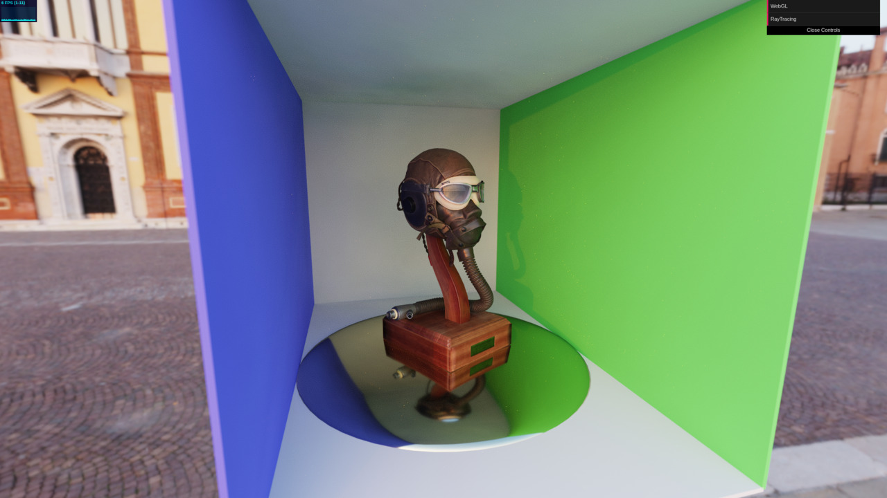

# Ray Tracing Renderer
A [Three.js](https://github.com/mrdoob/three.js/) renderer which utilizes path tracing to render a scene with true photorealism. The renderer supports global illumination, reflections, soft shadows, and realistic environment lighting.

[Demo](https://hoverinc.github.io/ray-tracing-renderer/scenes/sample-models/) | [User Guide](https://github.com/hoverinc/ray-tracing-renderer/wiki/User-Guide) | [API Reference](https://github.com/hoverinc/ray-tracing-renderer/wiki/RayTracingRenderer) | [Contributing](https://github.com/hoverinc/ray-tracing-renderer#contributing)


## Usage

RayTracingRenderer is the *early alpha stage* of development. Features are incomplete and subject to change, and the renderer is unstable on certain hardware.
### Download

* [Latest ES6 Build](https://raw.githubusercontent.com/hoverinc/ray-tracing-renderer/master/build/RayTracingRenderer.js)
* [Latest ES5 Build](https://raw.githubusercontent.com/hoverinc/ray-tracing-renderer/master/build/RayTracingRenderer.es5.js)

Or if you use npm, run
`npm install ray-tracing-renderer`

Ray Tracing Renderer relies on WebGL2, and any browser supporting WebGL2 also supports ES6. Thus, you should only use the ES5 build if the renderer inside your appliaction is *optional*, and your application must support older browsers.

### Installation
#### As an HTML script
Ray Tracing Renderer requires Three.js, so make sure it is included in your html first. Then include,
```javascript
<script src="RayTracingRenderer.js"></script>
```

You can then use the renderer in your app.

```javascript
const renderer = new THREE.RayTracingRenderer();
```
#### As a module
If you installed via npm, simply import the renderer as follows.
```javascript
import { RayTracingRenderer } from 'ray-tracing-renderer'
```
Or if you downloaded the renderer as a file,
```javascript
import { RayTracingRenderer } from './RayTracingRenderer.js'
```
The renderer can then be used in your app.
```javascript
const renderer = new RayTracingRenderer();
```

## Introduction
Ray Tracing Renderer serves as a drop-in replacement to Three.js's [WebGLRenderer](https://threejs.org/docs/#api/en/renderers/WebGLRenderer). By simply swapping renderers, you can get instant photorealistic lighting.

[](https://hoverinc.github.io/ray-tracing-renderer/scenes/webgl-comparison/)
[(Click to run example)](https://hoverinc.github.io/ray-tracing-renderer/scenes/webgl-comparison/)

Ray Tracing Renderer runs on WebGL2, and does so by implementing a [path tracing](https://en.wikipedia.org/wiki/Path_tracing) algorithm inside a shader. It supports arbitrary Three.js scenes, with some restrictions.

### Features
* **Global illumination.** Surfaces are illuminated with light reflected from every surface, not just manually placed light sources. This results in natural looking renders with realistic light bouncing and propagation.
* **Soft Shadows.** Shadows are computed automatically without the need to configure shadow properties on Three.js's light sources. The resulting shadows are soft and true-to-life without any visual artifacts.
* **Reflections.** Shiny and metallic surfaces reflect their surroundings, greatly attributing to realism.
* **Environment lighting.** A new light type has been added which dynamically illuminates a scene entirely from an HDR environment map! Manually placed light sources are a thing of the past.

### Limitations
* **Progressive rendering.** Path tracing is a progressive method. This means that the more computation time that is spent on rendering, the better the resulting image looks. In order to render a high quality image, the camera must stay still for several seconds, as the render gradually improves. This is in stark contract to WebGLRenderer's method which is able to render a full quality image in one frame.
* **Static geometry**. A BVH acceleration structure is computed for the scene to speed up ray intersections. This computation can take several seconds when first initializing the renderer, and it must be recomputed whenever scene geometry moves or changes. Therefore only camera movement is supported in real-time.

For a more detailed guide on how to use the renderer, please read the [User Guide](https://github.com/hoverinc/ray-tracing-renderer/wiki/User-Guide) .

## Contributing
We want to increase test coverage and maintanability of the repo. If you would like to contribute, take a look at the following and submit Pull Requests:
* [CodeClimate issues](https://codeclimate.com/github/hoverinc/ray-tracing-renderer/issues) to improve maintainability, and
* Unit tests to [improve our coverage](https://codeclimate.com/github/hoverinc/ray-tracing-renderer/code)

Take a look to [this page](https://github.com/hoverinc/ray-tracing-renderer/wiki/Submitting-Changes) with more details about submitting changes to the project.

### Expectations

This repository started as a side-project and the time we invest on it is limited. It may take us a few days to get back to you but please bring your ideas forward. We'll do our best to respond promptly.
